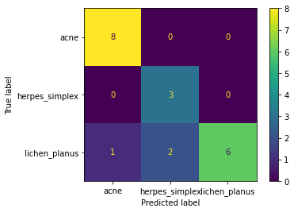

# Skin Disease Classification

**Hardware**:

- All experiments were trained using Google Colab's Tesla K10 GPU.
- Tensorflow 2.x was utilized for data preprocessing and model training.

**Experiments**:
- The Dataset was split 80-20, where 80% of the data is train set and 20% is valid set.
- The existing dataset was found to be unbalanced and have limited data.
- To avoid overfitting, the dataset was fine-tuned on pre-trained models trained on Imagenet for improved knowledge transfer and generalization.
- To address the issue of unbalanced classes, various methods were tried including data augmentation, focal loss inspired loss function, learning rate schedulers, class weighting and undersampling.
- Data Augmentation was applied to increase the size of the dataset and reduce overfitting, with techniques such as horizontal flip, rotation, height shift, width shift and zoom being used
- To handle unbalanced data, class weighting was employed.The class_weight function from the scikit-learn utils was used to compute the weights for each class, which were then fed to the model or the focal loss inspired loss function.
- Focal loss has been demonstrated to effectively address class imbalance issues in object detection. An extension of this concept was utilized in the form of focal sparse categorical crossentropy, which was inspired by focal loss and used as the loss function. I used focal-loss open-source library to add to loss function for training.
- To stabilize training and address unbalanced data, the use of learning rate schedulers is recommended. For some experiments, an exponential learning rate decay was employed.
- Undersampling is another solution for handling class imbalance. In this approach, the number of images for each class was matched to the lowest class count(16 in our case).

- For fine-tuning, I tried the following pre-trained models: MobileNetV2,ResNet50 and EfficientNet.
- Early Stopping was used to tackle varying validation losses.
- For Optimization, I used Adam with the standard 3e-4 learning rate as default.
- Please also note that the data is shuffled in the dataset to cover all of train distribution.

**Evaluation Metrics**:

- For evaluation, recall,f1 score, precision and confusion matrix were used. Recall was given higher preference.
- AUC was also used for some experiments

**Results**:

- Among all of the variation of the methods described above, Data Augmentation + Fine-tuned MobileNetV2 + focal_sparse_ce_loss(with Adam optimization) trained with the given unbalanced data(112 images in 3 classes) performed the best in terms of performance and metrics.
- Note that here MobileNetV2 is fine-tuned on the last few layers of the pre-trained model, did global average pooling and softmax over classes
-  Other variations didn't yield as compelling results. Some of them were either overfitting or performed worse or were unstable.
- The following is train-val graph of the best model:

- Based on my observation, I noticed that most of the models overfitted and had a hard time generalizing to the validation set. Some models generalized a bit better than others.
- I also tried training a CNN model from scratch but found that model overfitted a lot as we have less data for training.

**Training and Evaluation Code**:
- Please take a look at my oro_health_model_training.ipynb file for reviewing my training experiments
- Please run evaluation by running my oro_health_model_evaluation.ipynb file which makes use mobile_net.zip file

**Classification Report**:

- The following report results are derived from valid set
 
On GPU: 
 

 
On CPU:
 

- The performance metrics of the top model surpassed those of the other model variations.
- AUC of our best model is approximately 0.896

**Possible Improvements**
- I would train on 10 different random seeds and report mean and standard deviation for validation set(For reproducibility in training)
- I would try Meta Learning approaches like MAML etc
- I would try to make an AUC-ROC curve visualization
- I would make 3 different classifiers and train them seperately and predicting whether they have a disease or not 
- I also would try to oversample images and try out recent data augmentation methods like CutMix, Mixout etc
- I would also try to use other evaluation strategies like k-fold cross validation
- I would also try to fine-tune on pre-trained models trained on medical images of the similar distribution.
- I would input images to the models, determine and visualize what areas it is primarily paying attention to.
- I would also do an extensive hyperparameter search and try out different variations
